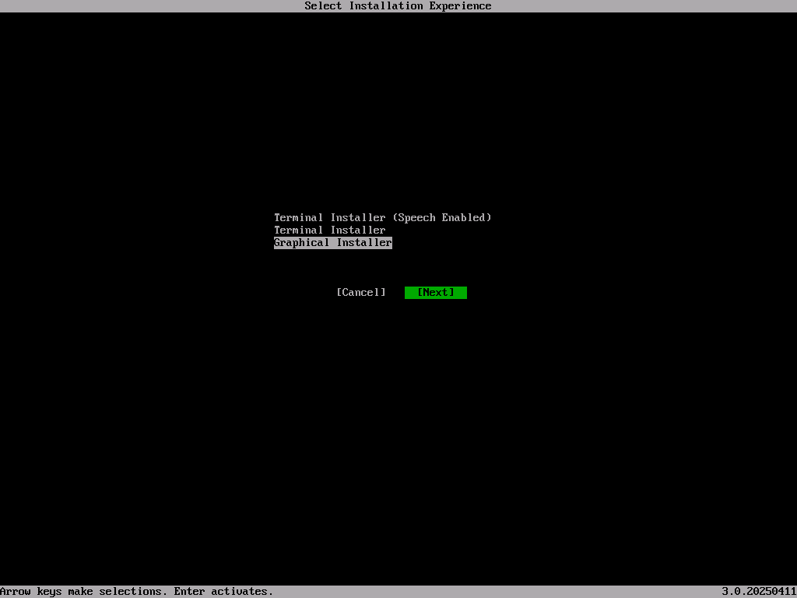
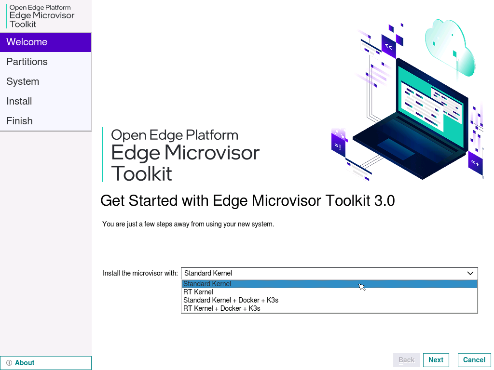
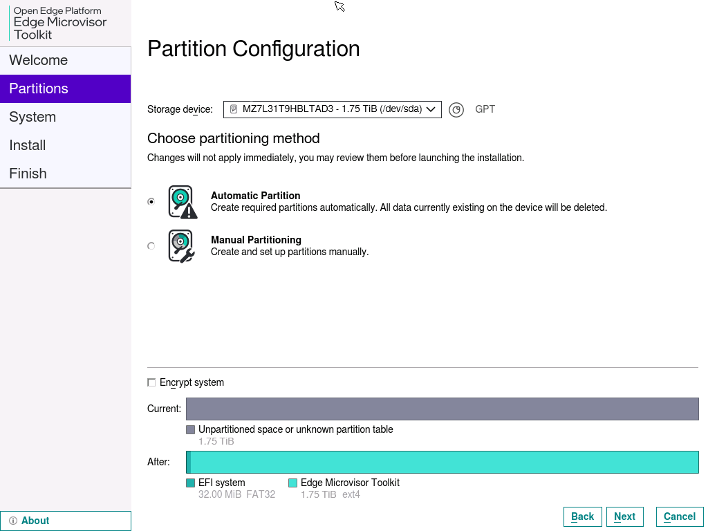
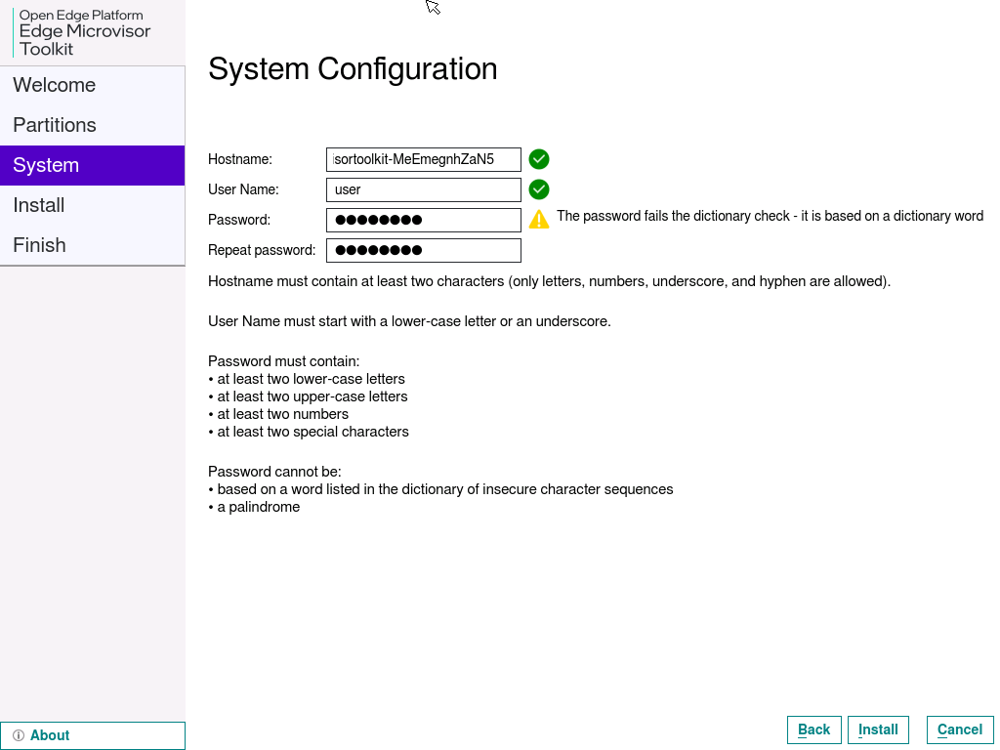
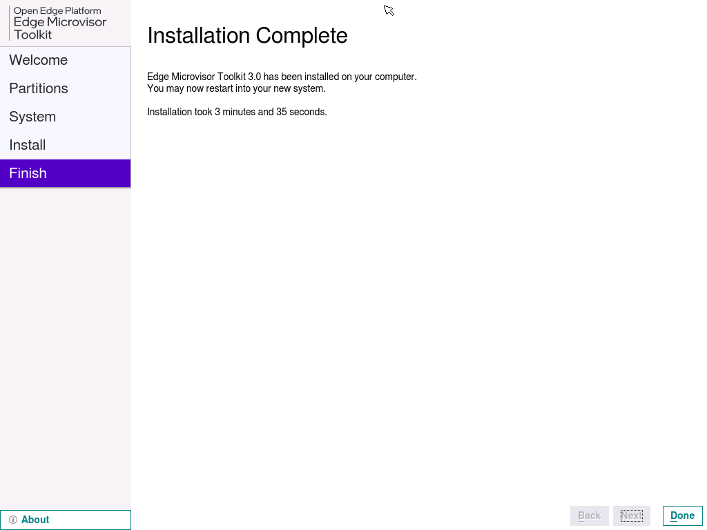

# Deploying Edge Microvisor Toolkit on Bare Metal

Below you will find all methods of deployment on Bare Metal with ISO image.

## Requirements

You will need:

- [Edge Microvisor Toolkit Developer Node 3.0](https://files-rs.edgeorchestration.intel.com/files-edge-orch/microvisor/iso/EdgeMicrovisorToolkit-3.0.iso).
- USB flash drive (min. 8GB).
- Access to the target machine.
- Optional: Monitor and keyboard, or BMC/iDRAC/iKVM access.

## Create Bootable USB (Linux)

Follow the steps below to create a bootable USB device to install Edge Microvisor Toolkit
on your bare metal system.

Ensure you have the microvisor ISO file you want to flash saved on your system. Insert the
USB drive and identify it.

```bash
lsblk
```

Compare the output before and after inserting your USB to identify its device name
(e.g., `/dev/sdb`). Flash the ISO Image. Use the `dd` command to write the ISO image.
Replace `/path/to/your.iso` with the ISO’s location and `/dev/sdb` with your USB device.

```bash
sudo dd if=/path/to/your.iso of=/dev/sdb bs=4M status=progress oflag=sync
# Warning: Double-check the device name. Using a wrong device can overwrite data.
```

Sync and Eject: Once `dd` has finished, run:

```bash
sudo sync
```

Then, safely remove the USB drive.

## Create Bootable USB (Windows)

On Windows, download and install ISO writer software such as [Rufus](https://rufus.ie/en).

1. Insert the USB device (8GB or more).
1. Launch Rufus.
1. Select the USB drive from the dropdown list.
1. Boot selection: Select your EMT 3.0 ISO file.
1. Image option: Leave default or choose *Standard Installation*.
1. Partition scheme: MBR (for legacy BIOS) or GPT (for UEFI).
1. File system: FAT32 (recommended).
1. Click *Start*.
1. Confirm warnings about data being erased.
1. Wait for completion and safely eject the USB.

## Boot and Install Edge Microvisor Toolkit

**Boot from USB**

1. Insert the USB into the target machine.
2. Enter the BIOS/Boot menu.
3. Choose the USB drive as the boot device.

**Select Installer**

1. Choose *Terminal Installer* or *Graphical Installer* when prompted

   

   **Follow Installation Prompts**

2. Choose the installation type:

   .

3. Select the target disk for installation and choose the partitioning method.

   .

4. Skip disk encryption (optional).
5. Create a username and a password. Keep the default *Hostname*.

   .

6. Click *Install* and confirm by clicking *Install Now*.

7. When the installation has completed, click *Done* to close the installer.

   .

   The system will reboot.

   **You are now ready to use Edge Microvisor Toolkit!**

## Post Installation Check

Check the version of Edge Microvisor Toolkit by running the following command:

```bash
cat /etc/os-release
```